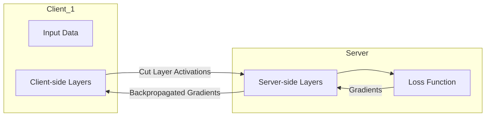
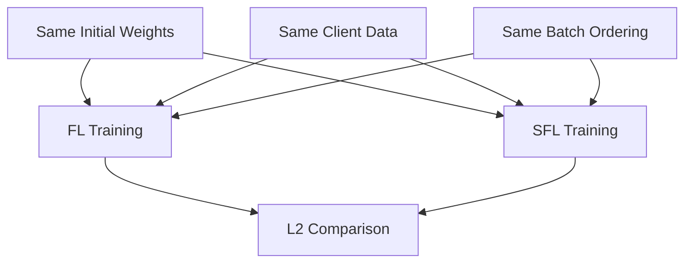
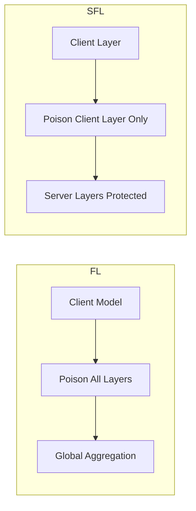
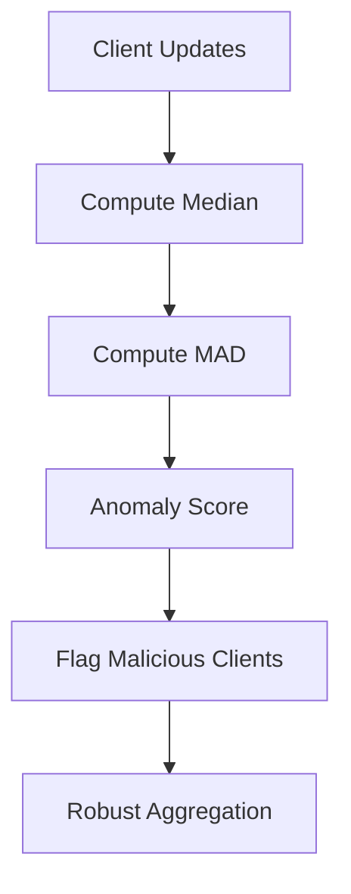
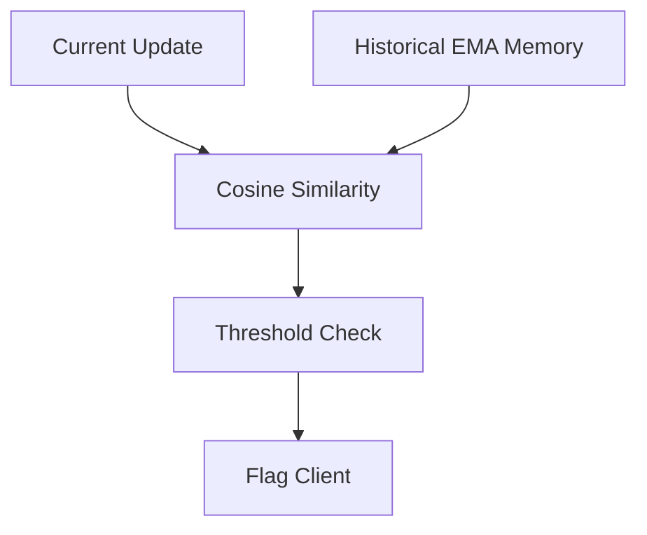
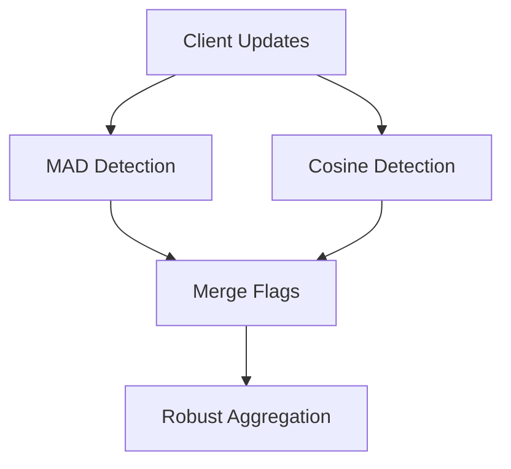

# Model Poisoning-Resilient Split Federated Learning (SFL)

## 📌 Overview

This project investigates Federated Learning (FL), Split Learning (SL), and Split Federated Learning (SFL), with a focus on robustness against poisoning attacks under highly heterogeneous Non-IID environments.

The work progresses from baseline FL implementations to controlled FL vs SFL equivalence studies, followed by adversarial attack simulations and multiple defence mechanisms. The experiments explore how SFL behaves compared to standard FL under extreme label skew, deeper architectures, and poisoning attacks.

The project particularly investigates whether Split Federated Learning provides structural robustness advantages against poisoning attacks due to its split client/server architecture and additional server-observable training behaviour.

---

# 🎯 Objectives

The main objectives of this project are:

- Implement baseline Federated Learning (FL)
- Evaluate IID and Non-IID distributed training behaviour
- Implement Split Learning (SL) and Split Federated Learning (SFL)
- Validate FL vs SFL mathematical equivalence
- Investigate the effect of deeper architectures under extreme Non-IID settings
- Simulate poisoning attacks using Sign Gradient Attack (SGA)
- Develop and evaluate multiple poisoning defence mechanisms
- Investigate whether SFL-specific observability can improve robustness

---



# 🔬 Experimental Progression

The project evolved through four major experimental stages:

## 1. Baseline Federated Learning

- IID vs Non-IID distributed learning analysis
- Multi-dataset comparison:
  - MNIST
  - Fashion-MNIST
  - CIFAR-10
- Convergence and stability analysis

---

## 2. Split Learning and Split Federated Learning

- Controlled FL vs SFL equivalence experiments
- Client/server model partitioning
- Synchronized optimization studies
- L2-distance equivalence tracking

---

## 3. Poisoning Attack Experiments

- Sign Gradient Attack (SGA)
- FL vs SFL attack robustness comparison
- Layer-specific attack behaviour
- Optimization divergence analysis

---

## 4. Defence Mechanism Experiments

- Median/MAD filtering
- Historical cosine similarity defence
- Hybrid combined defence
- SFL-aware server-observable defence

---

# 📁 Project Structure

```text
notebooks/
│
├── 01_fl_baseline_mnist.ipynb
├── 02_fl_multidataset_mnist_fmnist_cifar10.ipynb
├── 03_split_learning_vs_full_model.ipynb
├── 04_fl_vs_sl_equivalence_study_3clients_MNIST.ipynb
├── 05A_fl_vs_sfl_noniid_one_label_2LAYER.ipynb
├── 05B_fl_vs_sfl_noniid_one_label_3LAYER.ipynb
├── 05C_fl_vs_sfl_noniid_one_label_FMNIST.ipynb
├── 05D_fl_vs_sfl_noniid_one_label_CIFAR10.ipynb
├── 05E_fl_vs_sfl_noniid_one_label_4LAYER.ipynb
├── 05F_fl_vs_sfl_sga_attack.ipynb
├── 05G_fl_sfl_median_mad_defence.ipynb
├── 05H_fl_sfl_cosine_defence.ipynb
├── 05I_combined_defence.ipynb
├── 05J_sfl_aware_layer_specific_defence.ipynb

results/
│
├── plots/
├── csv/

weights/
│
├── fl/
├── sfl/

chapters/
│
├── file01.tex
├── file02.tex
├── ...
├── file05J.tex
├── overall_defence_comparison.tex
```

# 🧠 Notebook Summaries

## 01 — FL Baseline (MNIST)

### Main Features
- Standard Federated Learning
- MNIST dataset
- FedAvg aggregation
- Accuracy/loss tracking

### Purpose
Establish baseline FL training behaviour under standard distributed settings.

### Key Insight
Federated Learning converges reliably under IID conditions and provides the initial benchmark for later experiments.

---

## 02 — Multi-Dataset FL Analysis

### Main Features
- MNIST
- Fashion-MNIST
- CIFAR-10
- IID and Non-IID experiments
- Label skew studies

### Non-IID Configurations
- 1 label/client
- 2 labels/client
- 4 labels/client
- 6 labels/client

### Key Insight
Performance degrades significantly as:
- dataset complexity increases,
- and client label diversity decreases.

Extreme Non-IID environments become highly unstable.

---

## 03 — Split Learning vs Full Model

### Main Features
- Split Learning implementation
- 2 client layers
- 3 server layers
- Centralized comparison

### Key Insight
Split Learning can closely reproduce centralized training behaviour under controlled conditions.

---

## 04 — FL vs SFL Equivalence Study



### Main Features
- Deterministic synchronized training
- FL vs SFL equivalence
- Identical initialization
- Identical batch ordering
- Separate aggregation pipelines

### Metrics Tracked
- Global accuracy
- Global loss
- L2 parameter distance
- Timing comparison

### Key Insight
FL and SFL can remain mathematically equivalent when optimization conditions are synchronized.

---

## 05A — SFL under Extreme Non-IID
```text
05A:
784 → 256 → 10
```
### Main Features
- One label per client
- Two-layer architecture
- Closest configuration to TwoNN baseline

### Key Insight
Shallow architectures perform substantially better under extreme Non-IID conditions.

---

## 05B — Deeper 3-Layer SFL
```text
05B:
784 → 256 → 128 → 10
```

### Main Features
- 1 client layer
- 2 server layers

### Key Insight
Increasing model depth reduces convergence quality and final accuracy under one-label-per-client distributions.

---

## 05C — Fashion-MNIST under Extreme Non-IID

### Main Features
- Fashion-MNIST dataset
- Same 3-layer split architecture

### Key Insight
Training instability increases significantly as dataset complexity increases.

---

## 05D — CIFAR-10 under Extreme Non-IID

### Main Features
- CIFAR-10 dataset
- Same split architecture

### Key Insight
CIFAR-10 becomes extremely difficult under:
- shallow MLP architectures,
- extreme label skew,
- and Non-IID distributed learning.

---

## 05E — Deeper 4-Layer Architecture
```text
05E:
784 → 256 → 128 → 10 → 10
```
### Main Features
- 2 client layers
- 2 server layers
- Deeper architecture scaling

### Key Insight
Deeper architectures further worsen convergence under extreme Non-IID settings.

---

## 05F — Poisoning Attack (SGA)



### Main Features
- Sign Gradient Attack (SGA)
- FL vs SFL attack comparison
- Layer-specific poisoning

### Key Insight
Standard FL collapses catastrophically under attack, while SFL shows partial resilience because the attack only affects the client-side layer.

---

## 05G — Median/MAD Defence



### Main Features
- Median filtering
- Median Absolute Deviation (MAD)
- Robust statistical aggregation

### Key Insight
Median/MAD produced the most stable and reliable overall robustness against poisoning attacks.

---

## 05H — Historical Cosine Similarity Defence



### Main Features
- Historical cosine filtering
- EMA reference history
- Warm-up phase

### Key Insight
Cosine similarity alone is unstable under extreme Non-IID conditions and insufficient as a standalone defence.

---

## 05I — Combined Defence

### Main Features
- Median/MAD
- Historical cosine similarity
- Multi-signal anomaly filtering

### Key Insight
Combining magnitude-based and directional anomaly detection improved robustness compared to cosine-only defence.

---

## 05J — SFL-Aware Defence


### Main Features
- Server-observable loss analysis
- Layer-aware filtering
- SFL-specific defence logic

### Key Insight
SFL-specific observable behaviour may enable stronger privacy-preserving defence mechanisms compared to directly reusing traditional FL defence strategies.


# 📊 Key Research Findings

- FL and SFL can remain mathematically equivalent under synchronized training conditions.
- Extreme Non-IID data severely destabilizes distributed learning.
- One-label-per-client configurations create highly conflicting client gradients.
- Deeper architectures amplify optimization instability under label skew.
- Standard FL is highly vulnerable to strong poisoning attacks.
- SFL naturally limits attack influence because clients only control partial model layers.
- Median/MAD filtering provided the strongest overall robustness.
- Cosine similarity becomes unreliable under extreme Non-IID gradient divergence.
- SFL-aware defences can exploit server-observable behaviour without violating privacy assumptions.

---

# 📈 Defence Comparison Summary

## 05G — Median/MAD Defence

### ✅ Strengths

- Most stable overall defence
- Strong robustness under extreme Non-IID conditions
- Prevented catastrophic FL collapse
- Reliable under small client counts
- Robust against noisy gradients

### ⚠️ Weaknesses

- Less sensitive to directional anomalies
- May miss poisoned updates with normal magnitude

---

## 05H — Historical Cosine Defence

### ✅ Strengths

- Captured directional optimization behaviour
- Improved SFL robustness compared to no defence
- Introduced historical EMA client tracking
- Preserved privacy assumptions

### ⚠️ Weaknesses

- Highly unstable under one-label-per-client distributions
- Failed to prevent FL collapse
- Sensitive to noisy gradients
- Honest clients naturally diverged directionally under extreme Non-IID conditions

---

## 05I — Combined Defence

### ✅ Strengths

- Improved robustness compared to cosine-only defence
- Multi-signal anomaly filtering
- Strong FL stability
- Reduced false positives compared to standalone cosine

### ⚠️ Weaknesses

- More computationally complex
- Did not consistently outperform standalone Median/MAD
- Cosine component still affected by heterogeneous client gradients

---

## 05J — SFL-Aware Defence

### ✅ Strengths

- Uses server-observable behaviour
- Preserves SFL privacy assumptions
- Strong conceptual contribution toward architecture-aware defence
- Defence logic adapted specifically for SFL structure

### ⚠️ Weaknesses

- More complex implementation
- Still sensitive to severe client heterogeneity
- More oscillatory SFL convergence compared to pure Median/MAD

---

# 📊 Example Experimental Results

## 05F — Poisoning Attack Collapse


The undefended SGA poisoning attack causes catastrophic FL collapse, while SFL remains partially resilient because the attack only affects the client-side layer.

---

## 05G — Median/MAD Defence Recovery


Median/MAD filtering stabilizes both FL and SFL and prevents catastrophic divergence.

---

## 05I — Combined Defence


Combining Median/MAD with cosine similarity improves robustness compared to cosine-only defence and maintains stable convergence.

---

## 05J — SFL-Aware Defence


Server-observable SFL-aware defence demonstrates that split-aware anomaly filtering can preserve privacy while maintaining strong robustness.

---

# ⚠️ Key Observations

- Non-IID data fundamentally changes distributed learning behaviour.
- Deeper architectures worsen convergence under extreme label skew.
- FL aggregation alone is insufficient against strong poisoning attacks.
- SFL introduces additional server-side observability.
- These additional signals may enable stronger defence mechanisms.
- Small client counts make many traditional FL defence methods unreliable.
- Robust statistical filtering performs better than directional filtering under highly heterogeneous conditions.
- Cosine similarity becomes unreliable when honest clients naturally diverge in optimization direction.

---

# 🚀 Future Work

Potential future extensions include:

## Advanced Attacks

- Multiple attackers
- Adaptive poisoning attacks
- Targeted poisoning
- Activation manipulation attacks

---

## Advanced Models

- CNN-based SFL
- Transformer-based distributed learning
- Larger-scale architectures

---

## Advanced Defences

- Adaptive anomaly thresholds
- Temporal trust systems
- Dynamic aggregation weighting
- Reinforcement-learning-based defence policies

---

## Scalability Studies

- Larger client populations
- Realistic federated deployment environments
- Communication-constrained SFL

---

# ▶️ Running the Experiments

## Create Environment

```bash
conda create -n sfl python=3.11
conda activate sfl
```

## Install Dependencies

```bash
pip install -r requirements.txt
```

## Launch Jupyter

```bash
jupyter notebook
```

All experiments are located inside:

```text
notebooks/
```

---

# 🧠 Overall Conclusion

This project demonstrates that Split Federated Learning can reproduce Federated Learning behaviour under synchronized conditions while also exhibiting improved robustness characteristics under poisoning attacks.

The experiments show that:

- extreme Non-IID data fundamentally changes distributed optimization behaviour,
- deeper architectures amplify instability,
- and traditional FL defences do not directly transfer to SFL environments.

Among all tested approaches, Median/MAD filtering produced the strongest and most reliable overall robustness under poisoning attacks.

Cosine-based approaches provided useful directional anomaly information but struggled under highly heterogeneous client behaviour because honest clients naturally produced strongly divergent update directions.

The project also demonstrated that SFL-specific server-observable signals may enable new classes of privacy-preserving defence mechanisms that are not naturally available in standard Federated Learning.

Overall, the experiments suggest that:

- robust statistical filtering is more reliable than directional filtering under extreme Non-IID conditions,
- and architecture-aware SFL defence mechanisms represent an important future research direction.

---

# 👤 Author

**Raed Rahmanseresht**  
Master of Information Technology  
The University of Western Australia (UWA)